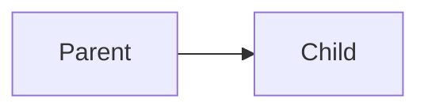

# Long Document Generation

Generate 10,000+ line educational documents with Preciz.

## Overview

Preciz can generate arbitrarily long documents using a block-based approach with **interactive content customization**:

- ✅ Scales to any length (10K, 50K, 100K+ lines)
- ✅ Maintains quality via review cycle
- ✅ Resumable if interrupted
- ✅ Interactive content preferences (audience, style, diagrams, code, etc.)
- ✅ Automatic Mermaid diagram conversion to PNG
- ✅ LLM-based fixing for broken diagrams

## Quick Start

### Interactive Mode (Prompts for Preferences)

```bash
# Will prompt for audience, style, content elements
preciz-gen-long "Differential Calculus" calculus.md

# With target lines
preciz-gen-long "Python Async" async.md --lines 5000
```

### Non-Interactive Mode (Use Flags)

```bash
# Advanced audience, direct style, no code
preciz-gen-long "API Design" api.md --audience advanced --style direct --no-code

# Beginner friendly with diagrams
preciz-gen-long "React" react.md --audience beginner --lines 10000

# Reference style, no diagrams
preciz-gen-long "HTTP History" http.md --style reference --no-diagrams --no-code
```

### Python API

```python
from preciz.orchestrator import DocumentOrchestrator
from preciz.preferences import ContentPreferences
from preciz.config import Config

config = Config.from_env()
orchestrator = DocumentOrchestrator(config)

# Create custom preferences
preferences = ContentPreferences(
    audience_level="beginner",
    teaching_style="progressive",
    include_analogies=True,
    include_code=True,
    include_diagrams=True,
    include_tables=True,
)

# Generate with preferences
orchestrator.generate_document(
    topic="Python Programming",
    output_file="python.md",
    preferences=preferences,
)
```

## How It Works

### Enhanced Block-Based Generation

```
┌─────────────────────────────────────────────────────────────┐
│  1. COLLECT PREFERENCES (Interactive or Flags)              │
│     - Audience level (beginner/intermediate/advanced)       │
│     - Teaching style (progressive/direct/reference)          │
│     - Content elements (code, diagrams, tables, analogies)  │
├─────────────────────────────────────────────────────────────┤
│  2. CREATE OUTLINE                                          │
│     Break topic into 50-100 sections                        │
├─────────────────────────────────────────────────────────────┤
│  3. FOR EACH SECTION:                                       │
│     ┌─────────────────────────────────────────────────────┐  │
│     │ a) GENERATE block (100-200 lines)                   │  │
│     │    Using custom preferences                          │  │
│     ├─────────────────────────────────────────────────────┤  │
│     │ b) REVIEW for quality                                │  │
│     │    Against preference requirements                   │  │
│     ├─────────────────────────────────────────────────────┤  │
│     │ c) IMPROVE if needed (up to N iterations)           │  │
│     ├─────────────────────────────────────────────────────┤  │
│     │ d) VERIFY & CONVERT MERMAID                         │  │
│     │    Extract diagrams → Convert to PNG → Replace      │  │
│     ├─────────────────────────────────────────────────────┤  │
│     │ e) APPEND to document                                │  │
│     └─────────────────────────────────────────────────────┘  │
│  4. ASSEMBLE final document with PNG images                │
└─────────────────────────────────────────────────────────────┘
```

## Content Customization

### Interactive Mode

When you run without customization flags, Preciz prompts you interactively:

```bash
$ preciz-gen-long "ReactJS" react.md

============================================================
  Content Customization for: ReactJS
============================================================

1. Target Audience:
   [1] Absolute Beginner (zero prior knowledge)
   [2] Intermediate (some prior knowledge)
   [3] Advanced (deep technical dive)
   Choose [1-3] [default: 1]: 1

2. Include Analogies?
   [Y]es - Use everyday analogies to explain concepts
   [N]o - Direct technical approach
   Include analogies? [Y/n] [default: Y]: Y

3. Include Code Examples?
   [Y]es - With runnable examples
   [N]o - Concepts and theory only
   Include code? [Y/n] [default: Y]: Y
   Language [default: auto-detect]: javascript
   Examples per section [default: 3]: 5

4. Include Diagrams?
   [Y]es - Add mermaid diagrams
   [N]o - Text-only content
   Include diagrams? [Y/n] [default: Y]:

5. Include Comparison Tables?
   [Y]es - Add tables for concepts
   [N]o - No tables
   Include tables? [Y/n] [default: Y]:

6. Teaching Style:
   [1] Progressive - Foundation → Concept → Implementation
   [2] Direct - Jump straight to technical content
   [3] Reference - Encyclopedia style
   Choose [1-3] [default: 1]: 1

============================================================
  Configuration Summary
============================================================
  Audience:      Beginner
  Style:         Progressive
  Analogies:     Yes
  Code:          Yes
    Language:    javascript
    Examples:    5/section
  Diagrams:      Yes
  Tables:        Yes
============================================================
```

### Non-Interactive Mode

Use flags to skip prompts and set preferences directly:

| Flag | Values | Description |
|------|--------|-------------|
| `--audience <level>` | beginner, intermediate, advanced | Target audience level |
| `--style <style>` | progressive, direct, reference | Teaching style |
| `--no-analogies` | - | Skip everyday analogies |
| `--no-code` | - | Skip code examples (theory only) |
| `--no-diagrams` | - | Skip mermaid diagrams |
| `--no-tables` | - | Skip comparison tables |
| `--code-lang <lang>` | python, javascript, etc. | Specific language for code |
| `--code-examples <n>` | number | Examples per section (default: 3) |

### Examples

```bash
# Code-heavy, advanced audience
preciz-gen-long "API Design" api.md --audience advanced --style direct --code-examples 5

# Conceptual, no code, with diagrams
preciz-gen-long "System Design" design.md --no-code --audience intermediate

# Quick reference, no frills
preciz-gen-long "Python Cheatsheet" py.md --style reference --no-analogies --no-diagrams

# Tutorial with all features
preciz-gen-long "React Tutorial" react.md --audience beginner --code-lang typescript
```

### Audience Levels

| Level | Description | Content Style |
|-------|-------------|---------------|
| `beginner` | Zero prior knowledge | Everyday analogies, step-by-step, "why" before "what" |
| `intermediate` | Some prior knowledge | Bridges from known concepts, targeted analogies |
| `advanced` | Deep technical dive | Formal definitions, architecture, production patterns |

### Teaching Styles

| Style | Description | Structure |
|-------|-------------|-----------|
| `progressive` | Build from zero to mastery | Foundation → Concept → Implementation → Mastery |
| `direct` | Jump to technical content | Core Concepts → Implementation → Reference |
| `reference` | Encyclopedia style | Hierarchical organization, comprehensive coverage |

## Mermaid Diagram Verification

### Automatic Conversion

When `--no-diagrams` is NOT specified, Preciz automatically:

1. **Extracts** all Mermaid code blocks from generated content
2. **Converts** each to PNG using `mmdc` (mermaid-cli)
3. **Fixes** broken diagrams using LLM (up to 3 retries)
4. **Replaces** Mermaid code with image references

### Installation

```bash
# Install mermaid-cli (required for PNG conversion)
npm install -g @mermaid-js/mermaid-cli
```

### Diagram Styling

Generated diagrams follow these style requirements:

- **Horizontal layout** (`flowchart LR` or `graph LR`)
- **Neutral theme** with white arrow styling
- **Color coding** with classDef
- **Emoji icons** in labels (🚀, ✅, 🚨, 🔄, 📊, 🎯, 🧠)
- **Descriptive labels** (not A, B, C)
- **Wide aspect ratio** (3.5:1 to 4:1)

### Example Output

**Before Generation:**
`````
## Component Flow


```
```

**After Generation:**
`````
## Component Flow


```

**Generated Files:**
- `document.md` - Markdown with image references
- `images/mermaid-1-1-component-flow.png` - Rendered diagram

### LLM-Based Fixing

If a Mermaid diagram fails to convert, Preciz asks the LLM to fix it:

```
[1/3] React Components
  → Found 2 Mermaid diagram(s)
     Converting diagram 1...
  ✓ Converted: mermaid-1-1.png
     Converting diagram 2...
  ⚠ Conversion failed, asking LLM to fix...
  ✓ Converted: mermaid-1-2.png
```

The LLM is prompted with:
- The error message from `mmdc`
- The broken Mermaid code
- Context about what the diagram should show
- Style requirements

It retries up to 3 times before giving up and keeping the original Mermaid code.

## CLI Usage

### Basic Command

```bash
preciz-gen-long <topic> <output_file> [options]
```

### Options

| Option | Description | Default |
|--------|-------------|---------|
| `--lines <n>` | Target line count | 10000 |
| `--iter <n>` | Max review iterations per block | 2 |
| `--gen-mode <mode>` | Generation mode (auto, llm, parts, custom) | auto |
| `--parts <n>` | Number of parts for 'parts' mode | auto |
| `--audience <level>` | Target audience (beginner/intermediate/advanced) | Interactive |
| `--style <style>` | Teaching style (progressive/direct/reference) | Interactive |
| `--no-analogies` | Skip everyday analogies | - |
| `--no-code` | Skip code examples | - |
| `--no-diagrams` | Skip mermaid diagrams | - |
| `--no-tables` | Skip comparison tables | - |
| `--code-lang <lang>` | Specific language for code | Auto-detect |
| `--code-examples <n>` | Number of code examples per section | 3 |

### Generation Modes

| Mode | Description | When to Use |
|------|-------------|-------------|
| `auto` | Try LLM outline, fallback to parts | Default |
| `llm` | Use LLM to create detailed outline | Best quality |
| `parts` | Simple numbered parts | Most reliable |
| `custom` | Load sections from JSON file | Full control |

## Examples

```bash
# Beginner tutorial with all features
preciz-gen-long "React Basics" react.md --audience beginner

# Advanced reference, no fluff
preciz-gen-long "API Patterns" api.md --audience advanced --style direct --no-analogies

# Conceptual guide, no code
preciz-gen-long "System Design" design.md --no-code --audience intermediate

# Code-heavy tutorial
preciz-gen-long "Python Advanced" py.md --audience advanced --code-examples 5

# Quick reference
preciz-gen-long "Git Cheatsheet" git.md --style reference --no-diagrams --no-code
```

## Troubleshooting

**Issue**: Mermaid diagrams not converting

**Solution**: Install mermaid-cli: `npm install -g @mermaid-js/mermaid-cli`

**Issue**: Generated content still has code despite `--no-code`

**Solution**: Some topics (like ReactJS) require code to explain properly. The LLM may include minimal code deemed necessary.

**Issue**: Too many review iterations

**Solution**: Reduce `--iter` or improve prompt adherence with better preferences.

## See Also

- [CLI Commands](cli.md)
- [Logging](logging.md)
