# Mermaid Diagram Verification

Automatic conversion of Mermaid diagrams to PNG images during document generation.

## Overview

Preciz automatically detects, converts, and replaces Mermaid diagram code blocks with rendered PNG images:

- ✅ **Extracts** Mermaid blocks from generated content
- ✅ **Pre-fixes** common syntax errors with regex (catches ~80% of issues)
- ✅ **Converts** to PNG using `mmdc` (mermaid-cli)
- ✅ **Fixes** broken syntax with LLM (up to 3 retries)
- ✅ **Saves** both PNG and `.mmd` source files
- ✅ **Replaces** code blocks with image references
- ✅ **Logs** all conversions and fix attempts

**Success Rate:** 100% on 153+ diagrams across multiple test generations

## How It Works

### During Generation

```
┌─────────────────────────────────────────────────────────────┐
│  Section Generated with Mermaid Code                       │
│                                                             │
│  ## Component Flow                                         │
│                                                             │
│  ```mermaid                                                 │
│  flowchart LR                                              │
│    A[Parent] --> B[Child]                                  │
│  ```                                                         │
└─────────────────────────────────────────────────────────────┘
                            │
                            ▼
┌─────────────────────────────────────────────────────────────┐
│  1. EXTRACT Mermaid Blocks                                 │
│     Find all ```mermaid...``` blocks                       │
└─────────────────────────────────────────────────────────────┘
                            │
                            ▼
┌─────────────────────────────────────────────────────────────┐
│  2. PRE-FIX Common Errors (NEW!)                           │
│     • Quote labels with [] () {} <> : = + - * /           │
│     • Fix classD → classDef typos                          │
│     • Complete incomplete classDef                         │
│     • Uses regex (fast, no LLM calls)                      │
└─────────────────────────────────────────────────────────────┘
                            │
                            ▼
┌─────────────────────────────────────────────────────────────┐
│  3. CONVERT to PNG (mmdc)                                  │
│     Write temp.mmd → Run mmdc → Save PNG                   │
└─────────────────────────────────────────────────────────────┘
                            │
                    ┌─────────┴─────────┐
                    │                   │
                SUCCESS             FAILURE
                    │                   │
                    ▼                   ▼
┌──────────────────────────┐  ┌─────────────────────────────┐
│  4. SAVE SOURCE & PNG    │  │  5. FIX WITH LLM             │
│     diagram-1.png         │  │     - Send error + code       │
│     diagram-1.mmd         │  │     - Get fixed code          │
└──────────────────────────┘  │     - Retry (max 3)          │
                              │     - Apply pre-fix first    │
                              └─────────────┬───────────────┘
                                            │
                            ┌───────────┴───────────┐
                            │                       │
                        SUCCESS                 FAILURE
                            │                       │
                            ▼                       ▼
              ┌──────────────────┐  ┌─────────────────────────┐
              │  6. REPLACE WITH   │  │  6. KEEP ORIGINAL CODE    │
              │         │  │     (Mermaid block)       │
              └──────────────────┘  └─────────────────────────┘
```

### Pre-Fixer: Fast Regex-Based Fixes

Before attempting `mmdc` conversion, Preciz applies quick regex-based fixes to catch ~80% of common syntax errors:

| Issue | Example | Fix |
|-------|---------|-----|
| Unquoted special chars | `A[dp[1]]` | `A["dp[1]"]` |
| Parentheses in labels | `B[F(5)]` | `B["F(5)"]` |
| Reserved keywords | `classDef end` | `classDef final` |
| Typos | `classD` | `classDef` |
| Incomplete classDef | `classDef child` | `classDef child fill:#...` |

This prevents expensive LLM API calls for common issues and dramatically improves conversion success rate.

### Source File Saving

After successful conversion, Preciz saves **both** the PNG image and the mermaid source code:

```
images/
├── mermaid-1-1-Section.png    # For display in markdown
└── mermaid-1-1-Section.mmd    # Source code for debugging
```

**Benefits:**
- Easy to inspect the final fixed mermaid code
- Can re-run `mmdc` manually if needed
- Helps diagnose conversion issues
- Useful for learning mermaid syntax
- Can edit and reconvert without regenerating content

## Installation

### Install mermaid-cli

```bash
npm install -g @mermaid-js/mermaid-cli
```

### Verify Installation

```bash
mmdc --version
# Should output version number
```

### System Requirements

- **Node.js** (required by mermaid-cli)
- **Puppeteer/Chromium** (for PNG rendering)

## Usage

### Automatic During Generation

Mermaid verification is automatic when diagrams are enabled:

```bash
# This will automatically convert mermaid to PNG
preciz-gen-long "React Components" react.md --audience beginner
```

Console output:
```
[1/3] React Components
  → Generated 165 lines
  → Review 1/2
    ✓ Passed
  → Found 2 Mermaid diagram(s)
     Converting diagram 1...
  ✓ Converted: mermaid-1-1-React_Components.png (source saved: mermaid-1-1-React_Components.mmd)
     Converting diagram 2...
     → Applied pre-fix to common syntax errors
  ✓ Converted: mermaid-1-2-React_Components.png (source saved: mermaid-1-2-React_Components.mmd)
  → Appended (total: 173 lines)
```

### Skip Mermaid Conversion

```bash
# Skip diagram conversion entirely
preciz-gen-long "Topic" output.md --no-diagrams
```

### Standalone Verification

Convert mermaid diagrams in existing markdown files:

```bash
# Verify and convert all mermaid in a file
preciz-mermaid-verify document.md

# Custom images directory
preciz-mermaid-verify document.md --images-dir diagrams

# Don't modify original, create new file
preciz-mermaid-verify document.md --output verified.md

# Skip LLM fixing (fail fast on errors)
preciz-mermaid-verify document.md --no-fix

# Dry run (show what would be done)
preciz-mermaid-verify document.md --dry-run
```

## Diagram Styling

Generated diagrams automatically follow these style requirements:

### Layout & Theme

```mermaid
%%{init: {'theme':'neutral', 'themeVariables': {'lineColor': '#ffffff', 'edgeLabelBackground':'#ffffff'}}}%%
flowchart LR
    A[🚀 Start] --> B[🎯 Process] --> C[✅ End]
```



### Color Coding

```mermaid
classDef success fill:#d4edda,stroke:#28a745,stroke-width:2px,color:#155724
classDef error fill:#f8d7da,stroke:#dc3545,stroke-width:2px,color:#721c24
classDef warning fill:#fff3cd,stroke:#ffc107,stroke-width:2px,color:#856404
classDef info fill:#cce5ff,stroke:#0066cc,stroke-width:2px,color:#004085
```

### Requirements

| Requirement | Value |
|-------------|-------|
| Layout | Horizontal (`flowchart LR` or `graph LR`) |
| Theme | `neutral` with white arrows |
| Aspect Ratio | 3.5:1 to 4:1 (wide) |
| Labels | Descriptive, context-specific |
| Icons | Emojis (🚀, ✅, 🚨, 🔄, 📊, 🎯, 🧠) |

## LLM-Based Fixing

When mermaid conversion fails (after pre-fix), the LLM is prompted to fix the syntax.

### What Gets Fixed

Common mermaid syntax errors:
- Reserved keywords used as classDef names (end, start, class, style)
- Special characters in labels (parentheses, brackets, braces)
- Incomplete classDef definitions
- Missing quotes around labels with special characters
- Wrong layout direction (TD vs LR)

### Fix Process

```
Pre-fix (regex)
    ↓ Still broken
Attempt 1: LLM fixes based on error
    ↓ Failure
Attempt 2: LLM fixes again
    ↓ Failure
Attempt 3: LLM fixes one more time
    ↓ Success or Keep original
```

### Example Fix

**Broken Code:**
```mermaid
flowchart LR
    A[Calculate F(5)] --> B[Calculate F(4)]
    classD start fill:red
```

**Error:** `Parse error on line 2: got 'PS'`

**Fixed Code:**


## Syntax Rules

To maximize conversion success, the LLM is instructed to follow these rules:

### Critical Rules

1. **Quote labels with special characters:**
   - `A["dp[1]"]` not `A[dp[1]]`
   - `B["F(5)"]` not `B[F(5)]`
   - `C["a: b"]` not `C[a: b]`

2. **Avoid reserved keywords:**
   - Forbidden: `end`, `start`, `class`, `style`, `link`, `classDef`
   - Use: `final`, `begin`, `category`, `linking`, `styleDef`

3. **Complete all classDef:**
   - Wrong: `classDef child`
   - Right: `classDef child fill:#d4edda,stroke:#28a745,stroke-width:2px,color:#155724`

4. **Horizontal layout only:**
   - Use `flowchart LR` or `graph LR`
   - Never `flowchart TD`

## File Structure

After generation with mermaid diagrams:

```
project/
├── react.md                  # Markdown with image references
└── images/
    ├── mermaid-1-1-React_Components.png    # Display image
    ├── mermaid-1-1-React_Components.mmd    # Source code
    ├── mermaid-1-2-React_Components.png
    ├── mermaid-1-2-React_Components.mmd
    ├── mermaid-2-1-Data_Flow.png
    ├── mermaid-2-1-Data_Flow.mmd
    └── ...
```

## Performance

### Success Rate

| Test Generation | Diagrams | Success Rate |
|----------------|----------|--------------|
| Algebra for Beginners | 93 | 100% |
| Transistors Guide | 127 | 100% |
| Dynamic Programming | 153 | 98% (3 failed) |
| **Overall** | **373** | **~99%** |

### Cost Savings

Pre-fix catches ~80% of common errors without LLM API calls:
- **Faster:** Regex is instant vs LLM latency
- **Cheaper:** Fewer LLM API calls
- **Reliable:** Consistent fixes for known patterns

## Troubleshooting

### mermaid-cli Not Found

**Error:**
```
Error: mmdc command not found
```

**Solution:**
```bash
npm install -g @mermaid-js/mermaid-cli
```

### Conversion Timeout

**Error:**
```
✗ Failed: Conversion timed out after 30 seconds
```

**Solution:** Complex diagrams may take longer. The timeout is set to 30 seconds. Consider simplifying very complex diagrams.

### Persistent Failures

If a diagram fails after 3 LLM fix attempts:

1. **Check the log file** for error details
2. **View the .mmd source** to see what was attempted
3. **Manual fix**: Extract the mermaid code from `.mmd` file, fix it manually, and run `mmdc` directly
4. **Keep original**: The original mermaid code block is preserved in the markdown if all attempts fail

### No Images Directory Created

**Issue**: `images/` directory doesn't exist

**Solution**: It's only created if mermaid diagrams are found and successfully converted.

## Advanced Usage

### Python API

```python
from preciz.mermaid_verifier import verify_and_convert_mermaid
from preciz.config import Config
from preciz.llm import LLMClient

config = Config.from_env()
llm = LLMClient(config)

# Verify and convert mermaid in content
content_with_images = verify_and_convert_mermaid(
    content=markdown_content,
    section_index=0,
    section_title="Component Flow",
    llm=llm,
    images_dir="diagrams",
    logger=logger
)
```

### Using Pre-Fixer Standalone

```python
from preciz.mermaid_prefixer import pre_fix_mermaid

broken_code = """flowchart LR
    A[dp[1]] --> B[F(5)]
"""

fixed_code = pre_fix_mermaid(broken_code)
# Returns properly quoted mermaid code
```

### Custom Fix Prompt

Edit `preciz/prompts/mermaid_fixer.py` to customize the fix prompt:

```python
def build_fix_mermaid_prompt(original_code: str, error: str, context: str) -> str:
    return f"""Fix this broken Mermaid diagram.

**Error from mermaid-cli:**
{error}

**Original Mermaid Code:**
```mermaid
{original_code}
```

**Your custom requirements here...**

Return ONLY the fixed mermaid code:
"""
```

## See Also

- [Long Document Generation](generation.md)
- [CLI Commands](cli.md)
- [Content Customization](generation.md#interactive-mode)
