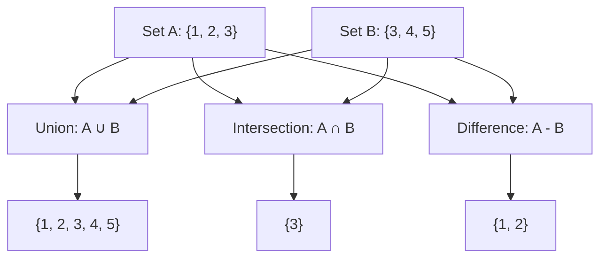

# Python Sets

*Generated by Preciz*  

---


# Introduction

## Introduction to Sets

Sets are a fundamental data structure in computer science and mathematics, representing a collection of **unique** elements. Unlike lists or arrays, sets do not allow duplicates and are unordered. This makes them incredibly efficient for membership testing and mathematical operations.

### What is a Set?

Think of a set like a bag of unique items. If you try to put an item that's already in the bag, it simply stays as is—no duplicates. Because the items aren't ordered, you can't ask "what's the 2nd item?" but you can quickly ask "is this item in the bag?"

```python
# Creating a set from a list with duplicates
fruits = ["apple", "banana", "apple", "orange", "banana"]
unique_fruits = set(fruits)
print(unique_fruits)  # Output: {'orange', 'banana', 'apple'} (order may vary)
```

### Why Use Sets?

Sets excel at three main operations:
- **Fast membership testing**: Check if an element exists in O(1) time
- **Eliminating duplicates**: Automatically remove repeated values
- **Mathematical operations**: Union, intersection, difference

```python
# Real-world example: Finding common visitors
week1_visitors = {"alice", "bob", "charlie", "diana"}
week2_visitors = {"bob", "eve", "frank", "alice"}

# Who visited both weeks?
repeat_visitors = week1_visitors.intersection(week2_visitors)
print(repeat_visitors)  # Output: {'alice', 'bob'}
```

### Set Operations

The diagram below shows how sets can be combined and compared:

```mermaid
flowchart TD
    A[Set A: {1, 2, 3}] -->|Union| C[Set C: {1, 2, 3, 4, 5}]
    B[Set B: {3, 4, 5}] -->|Union| C
    A -->|Intersection| D[Set D: {3}]
    B -->|Intersection| D
    A -->|Difference| E[Set E: {1, 2}]
    B -->|Difference| F[Set F: {4, 5}]
```

### Comparison with Other Data Structures

| Feature | Set | List | Dictionary |
|---------|-----|------|------------|
| **Order** | Unordered | Ordered | Ordered (Python 3.7+) |
| **Duplicates** | No | Yes | Keys: No, Values: Yes |
| **Lookup Speed** | O(1) | O(n) | O(1) for keys |
| **Use Case** | Membership, uniqueness | Sequential data | Key-value mapping |
| **Syntax** | `{1, 2, 3}` or `set()` | `[1, 2, 3]` | `{'a': 1, 'b': 2}` |

### Common Pitfalls

```python
# Pitfall 1: Creating an empty set
empty_set = set()      # Correct
empty_set = {}         # WRONG! This creates a dictionary

# Pitfall 2: Sets can't contain mutable elements
# valid_set = {1, 2, [3, 4]}  # TypeError: unhashable type: 'list'

# Pitfall 3: Order is not preserved
numbers = {5, 2, 8, 1}
print(numbers)  # Might print {1, 2, 5, 8} - order is not guaranteed
```

### When NOT to Use Sets

Avoid sets when:
- You need to maintain insertion order (use lists)
- You need to access elements by index
- You need duplicate values
- You need to store mutable objects like lists or dictionaries (though you can use frozensets for immutable sets)

# Basic Operations

## Basic Operations

Set operations allow you to combine, filter, and transform collections of unique items. Think of sets like a bag of unique marbles—you can merge bags, find marbles that exist in both bags, or keep only the marbles that are in one bag but not the other.

### Visualizing Set Relationships

Before diving into code, let's visualize how the three fundamental operations work:



### Union Operation

The **union** combines two sets, keeping only unique elements. It's like merging two guest lists for a party—no duplicates allowed.

**Example 1: Merging User Permissions**

```python
# Two teams have different access permissions
admin_perms = {'delete', 'modify', 'view'}
support_perms = {'view', 'escalate'}

# Union gives complete permission set without duplicates
all_perms = admin_perms.union(support_perms)
print(all_perms)  # {'delete', 'modify', 'view', 'escalate'}

# Shorthand operator (|)
all_perms_alt = admin_perms | support_perms
```

**Common Pitfall**: Union doesn't modify the original sets. It creates a new set.

### Intersection Operation

The **intersection** finds elements that exist in *both* sets. Use this when you need to find common ground.

**Example 2: Finding Overlapping Skills**

```python
# Developer skills and required skills for a task
dev_skills = {'python', 'git', 'sql', 'docker'}
required_skills = {'python', 'docker', 'kubernetes'}

# Intersection shows what the developer already has
matches = dev_skills.intersection(required_skills)
print(matches)  # {'python', 'docker'}

# What's missing? (set difference)
missing = required_skills - dev_skills
print(missing)  # {'kubernetes'}
```

### Difference Operation

The **difference** operation (`A - B`) returns elements in set A that are *not* in set B. It's like subtracting one list from another.

**Example 3: Identifying Unique Records**

```python
# Finding new users who haven't been contacted
existing_users = {'alice@example.com', 'bob@example.com'}
campaign_users = {'alice@example.com', 'charlie@example.com', 'dave@example.com'}

# Who needs to be contacted for the first time?
new_users = campaign_users - existing_users
print(new_users)  # {'charlie@example.com', 'dave@example.com'}
```

### Comparison Summary

| Operation | Symbol | Description | Use Case | Result Size |
|-----------|--------|-------------|----------|-------------|
| **Union** | `\|` or `union()` | All unique elements from both sets | Merging collections | ≤ len(A) + len(B) |
| **Intersection** | `&` or `intersection()` | Elements common to both sets | Finding matches | ≤ min(len(A), len(B)) |
| **Difference** | `-` or `difference()` | Elements in A but not in B | Filtering out known items | ≤ len(A) |
| **Symmetric Difference** | `^` or `symmetric_difference()` | Elements in either set, but not both | Finding non-overlapping items | ≤ len(A) + len(B) |

### Performance Considerations

Set operations are **O(1)** average case for membership tests, making them extremely fast for lookups. However, building large sets takes **O(n)** memory. For small collections, lists might be simpler, but for membership testing and deduplication, sets are unbeatable.

**Pro Tip**: Use `frozenset()` when you need a set that can be used as a dictionary key or as a member of another set.